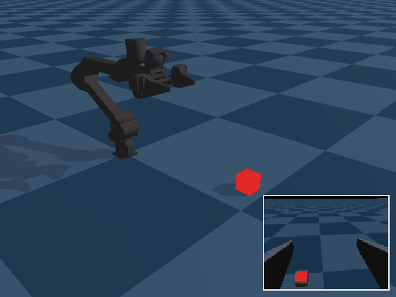

# WidowX AI Lift Cube in Genesis



The [Trossen WidowX AI](https://www.trossenrobotics.com/widowx-ai) arm grasps a 5 cm cube and lifts it to 20 cm, in the [Genesis](https://github.com/Genesis-Embodied-AI/genesis-world) simulator.
Training has two stages: a PPO teacher that sees the full simulator state, then a student that imitates it from a wrist camera image instead of the cube position.

Trossen's own [trossen_ai_isaac](https://github.com/TrossenRobotics/trossen_ai_isaac) has a WidowX AI lift task for Isaac Lab (`Isaac-Lift-Cube-WXAI-v0`). This repository runs the task on Genesis instead, and distills the state-based policy into one that acts from the wrist camera.

The code started from Genesis's [`examples/manipulation`](https://github.com/Genesis-Embodied-AI/genesis-world/tree/main/examples/manipulation) (a Franka grasping example).

## Setup

Requires Linux, an NVIDIA GPU and [uv](https://docs.astral.sh/uv/).

```bash
git clone https://github.com/kmymch/genesis-wxai-lift-cube.git
cd genesis-wxai-lift-cube
uv sync
```

This installs `genesis-world==1.4.3` from PyPI and the WidowX AI model from [trossen_arm_mujoco](https://github.com/TrossenRobotics/trossen_arm_mujoco).

## Usage

```bash
# 1. RL teacher (state-based PPO, 4096 parallel envs)
uv run python train.py --stage rl

# 2. Wrist-camera student (behavior cloning with DAgger, needs the teacher from step 1)
uv run python train.py --stage bc

# Evaluate one episode; --record writes videos to logs/lift_cube_<stage>/
uv run python eval.py --stage rl --record
uv run python eval.py --stage bc --record

# Success rate over 300 parallel episodes
uv run python eval.py --stage bc -B 300
```

Logs and checkpoints go to `logs/lift_cube_rl/` and `logs/lift_cube_bc/`; view the curves with `uv run tensorboard --logdir logs`.

## Files

| File | Contents |
| --- | --- |
| `env.py` | `GraspEnv` (scene, cameras, resets, rewards) and `Manipulator` (WidowX AI, damped least-squares IK, gripper) |
| `train.py` | Task, reward and training configurations; `--stage rl` or `--stage bc` |
| `behavior_cloning.py` | Student policy, DAgger data collection and training |
| `eval.py` | Runs a trained policy for one episode, optionally recording video |

## Task

| Item | Setting |
| --- | --- |
| Control | 100 Hz, 3 s episodes (300 steps) |
| Action (7) | Finger tip pose delta (±2 cm, ±0.05 rad per step) through damped least-squares IK, and gripper opening delta (±5 mm) |
| Teacher observation (11) | Finger tip pose (7), gripper opening (1), cube position (3) |
| Student input | Wrist RGB image (128 × 96), finger tip pose (7), gripper opening (1) |
| Cube | 5 cm, placed at x 0.30–0.55 m, y 0.00–0.20 m |
| Goal | Cube center at 20 cm |
| Randomization | Wrist camera pose jitter per episode (5 mm, about 0.04 rad per axis); color jitter on the student's images |

Rewards: reach the cube, with a gripper opening that closes as the finger tip nears it; lift the cube to the goal height, with a bonus once it leaves the floor; and action-rate and joint-velocity penalties.

## Results

Success means the cube is above 15 cm at the end of the 3 s episode. Evaluation uses the nominal wrist camera pose, without the training-time jitter.

| Policy | Input | Success rate | Training time |
| --- | --- | --- | --- |
| Teacher (PPO, 1000 iterations) | Cube position from the simulator | 100% (300 episodes) | 7 min |
| Student (DAgger, 400 iterations) | Wrist camera image | 87% (1,200 episodes, 4 seeds) | 34 min |

Training times are on one NVIDIA RTX 5000 Ada. Most student failures stop 4–5 cm short of the cube or fail to close on it.

## Student

The student does not see the cube position. A small CNN estimates it from the wrist image, relative to the finger tip, and an MLP maps the robot state and that estimate to the action, the same inputs the teacher gets.
Both are trained by imitating the teacher with DAgger: during data collection the student's own action is executed with a probability that rises from 0 to 0.5 over the first 100 iterations, and every step is labeled with the teacher's action and the true cube position.
Evaluation and checkpoints use an exponential moving average of the weights.

## License

Apache-2.0 (see [LICENSE](LICENSE)). Parts of the code are derived from Genesis's `examples/manipulation` (Apache-2.0).
The WidowX AI model is not redistributed here; it is installed from [trossen_arm_mujoco](https://github.com/TrossenRobotics/trossen_arm_mujoco) (BSD-3-Clause).
